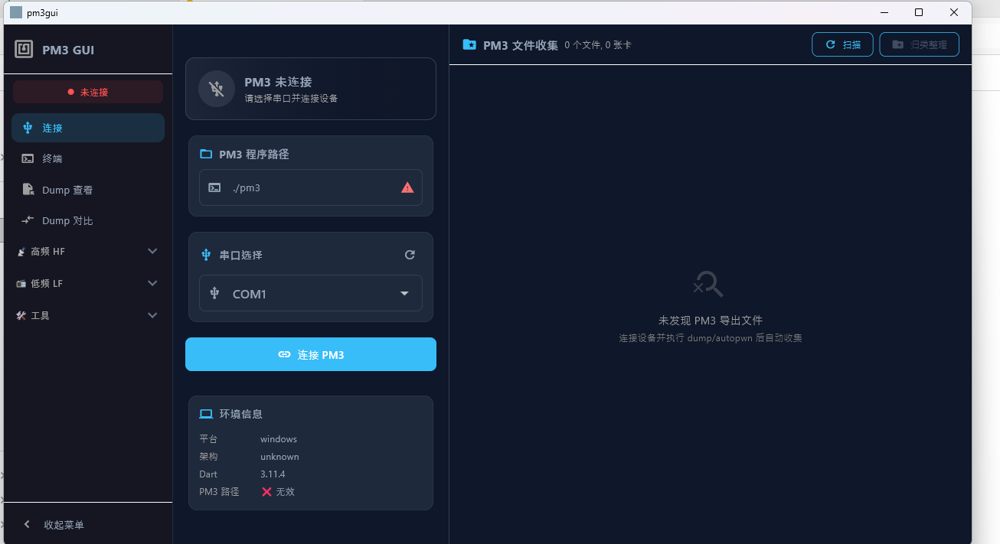

# 界面参考说明

项目已引入你提供的界面参考图，当前用于风格与布局对齐。

## 1. 参考素材

- 主参考图: `doc/image.png`
- 补充参考图: `doc/image copy.png`

## 2. 当前实现映射

- 顶部状态条:
  - 连接状态
  - 协议标识（UART3 / 20B / CRC16）
- 左侧操作区:
  - 串口端口与波特率
  - 常用功能码快捷按钮
  - 订单/货柜参数输入
- 右侧日志区:
  - TX/RX 帧时间线
  - 单行十六进制可读展示

## 3. 后续优化建议

- 按参考图补充图标与状态色语义一致性
- 增加功能码筛选与日志导出
- 增加“原始帧编辑器”用于高级调试

## 4. 素材预览

